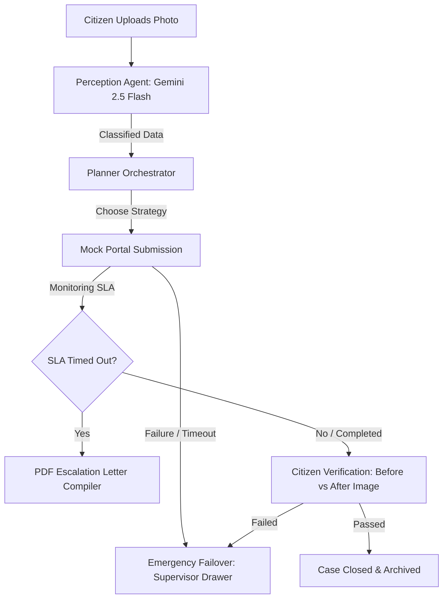

# ACIRP (Autonomous Civic Resolution Platform)
### *An AI-Agent Powered Operating System for Resilient Civic Incident Management*

[](https://fastapi.tiangolo.com/)
[](https://reactjs.org/)
[](https://ai.google.dev/)

---

## 🚀 Project Overview

**ACIRP** is a next-generation civic grievance platform designed as an **AI Operating System** rather than a static administrative dashboard. ACIRP replaces slow human triage queues and brittle databases with an autonomous agent loop that classifies hazards, plans jurisdictions, files petitions, monitors progress, compiles physical fallback alerts, and compares before/after photos using vision models to verify resolution.

### Key Architectural Innovation: "Resilient Failover Triage"
If public portals go offline or SLA timelines are breached, the agent autonomously halts backend requests and fails over to emergency routing protocols—compiling formal PDFs for physical dispatch and routing coordinates straight to ward supervisors.

---

## 🌟 Key Features

1. **🧠 Perception Agent (Gemini 2.5 Flash Vision):** Automatically extracts incident category, hazard details, and coordinates from uploaded citizen imagery.
2. **🎯 Intelligent Planner Core:** Evaluates jurisdictional routing strategies, calculates exact SLA deadlines, and monitors ticket status in portal registries.
3. **💥 Simulator Console & Time-Travel:** Interactive dashboard controls to simulate **Gateway Portal Crashes (HTTP 504)** and **24h Time Jumps (SLA Breaches)**.
4. **📄 Automatic Document Dispatcher:** Generates signed, formatted grievance dispatch PDFs directed to Chief Engineers on SLA breach.
5. **📸 Visual Verification Loop:** Compares Before and After cleanup photos side-by-side using vision comparison logic to confirm resolutions and archive tickets.
6. **🎨 Futuristic Glassmorphism UI:** Centered around a glowing, color-shifting **AI Orb** representing active reasoning states.

---

## 🛠️ System Architecture



---

## 💻 Tech Stack

* **Backend:** FastAPI (Python), Google GenAI SDK (Gemini 2.5 Flash), FPDF (PDF compiler)
* **Frontend:** React, Vite, Framer Motion (Transitions), TailwindCSS, Lucide React

---

## ⚡ Setup & Run Instructions

### 1. Backend Setup
1. Navigate to the backend folder:
   ```bash
   cd backend
   ```
2. Install Python dependencies:
   ```bash
   pip install fastapi uvicorn google-genai pydantic fpdf2
   ```
3. Set your Gemini API key:
   * **Windows (PowerShell):** `$env:GEMINI_API_KEY="your-key-here"`
   * **Linux/macOS:** `export GEMINI_API_KEY="your-key-here"`
4. Run the development server:
   ```bash
   uvicorn main:app --reload
   ```

### 2. Frontend Setup
1. Navigate to the frontend folder:
   ```bash
   cd ../frontend
   ```
2. Install Node dependencies:
   ```bash
   npm install
   ```
3. Run the Vite development server:
   ```bash
   npm run dev
   ```
4. Open [http://localhost:5173](http://localhost:5173) in your browser.
